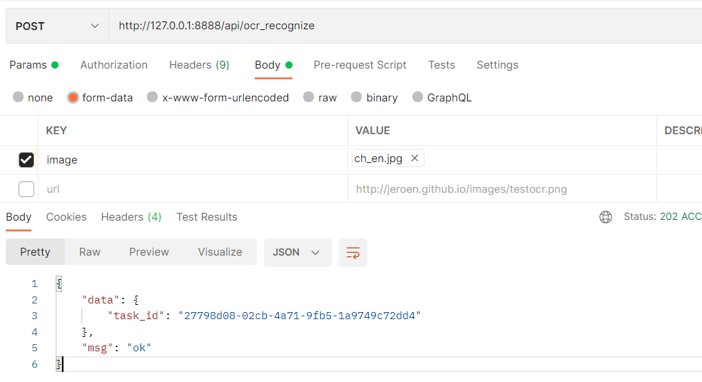

## 设计文档

####主要功能： 

本服务提供上传图片文件并识别其中的所有文字和字母。

上传可以是一个本地图片（jpg,png)或者一个url地址，返回一个json：
```json
{"content": [ 'Letter1', 'Letter2'...]}
```


### 数据库设计
1.表FileUPload

用于保存上传的图片记录， 字段包括文件名、文件存储路径、文件md5、文件的url（可选）

其中file_md5作为唯一值，多次提交不同的文件名（不同的url），但md5值相同，则只保存一条记录。

```python
    __tablename__ = 'file_upload'

    file_name = db.Column(db.String(256), nullable=False)
    file_path = db.Column(db.String(256), nullable=True)
    file_md5 = db.Column(db.String(128), index=True, nullable=False, unique=True)
    file_url = db.Column(db.String(256), nullable=True)
```

2. Results表

用于保存图片的识别结果， 其中按图片的md5值作唯一值

```python
    __table__name = 'results'

    file_md5 = db.Column(db.String(128), nullable=False, unique=True)
    ocr_results = db.Column(db.JSON, nullable=True)
```

3. Tasks表

用于保存每一次提交的任务信息。
```python
    __tablename__ = "tasks"

    task_id = db.Column(db.String(128), unique=True, nullable=False)
    file_md5 = db.Column(db.String(128), nullable=False)
    task_state = db.Column(db.String(64), nullable=True)
    timestamp = db.Column(db.DateTime, default=datetime.datetime.now())
```

注：在使用了celery + redis 后，该表可以不用，异步任务的结果通过redis 中taskid获取。

### 接口说明
1. /api/ocr_recognize  上传图片并返回后台任务id号

请求方法： POST

请求header：
```json
{
  "Content-Type": "multipart/form-data"
}
```
请求参数：
```json
{
  "image": File,
  "url": "url string"
}
```


参数说明：

|  参数   | 类型  | 说明 |
|  ----  | ----  | ----|
| image  | form的文件类型 | image和url二选一，image首选，它不为空时，url不需要传
| url  | string | image和url二选一，当image为空时，url需要传入

返回参数：

正常情况：
```json
{
    "data": {
        "task_id": "27798d08-02cb-4a71-9fb5-1a9749c72dd4"
    },
    "msg": "ok"
}

```


请求示例：
```
curl --location --request POST 'http://127.0.0.1:8888/api/ocr_recognize' \
--header 'Content-Type: multipart/form-data' \
--form 'image=@"/C:/Users/hyjun/Pictures/ch_en.jpg"'
```


3. /api/status/<task_id> 通过taskid号查询结果

请求方法： POST

请求header：
```json
{
  "Content-Type": "application/json"
}
```
请求参数：
```json
{
  "task_id": task_id
}
```

返回值：
正常：

```json
{"content":  ["a", "b"]}
```

参数说明：

|  参数   | 类型  | 说明 |
|  ----  | ----  | ----|
| task_id  | string | 任务id号


请求示例：
```

```

### 部署说明
### 1）直接部署
1.安装依赖包：
```shell
> cd ocrRecognition 
> source venv/bin/activate
> pip3 install -r requirements.txt
```
2.初始化并运行
开发环境：
```shell
> python3 server.py  >/dev/null 2>&1 &
> celery -A server.celery  worker -l info  >/dev/null 2>&1 &

```

### 2）Docker部署
